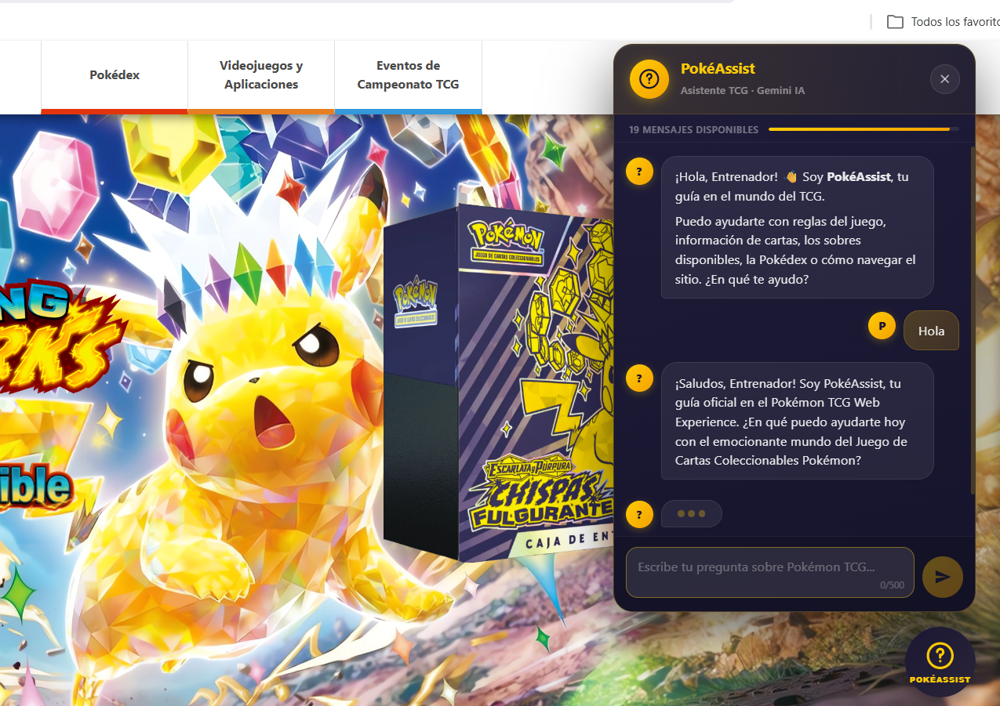

# Pokémon TCG Web Experience: Full-Stack Integration

**Pokémon TCG Web Experience** es una aplicación web interactiva de alto rendimiento que demuestra patrones avanzados de UI/UX, gestión de estado y renderizado 3D. Originalmente concebida como una prueba de concepto "Zero-JS", el proyecto ha evolucionado hacia una arquitectura **Full-Stack** moderna, integrando una lógica de cliente robusta y un backend potente.

---

## 📸 Screenshots

### Vista Principal


### Sobres y Cartas 3D Interactivos


### Asistente IA — PokéAssist



### API REST — Swagger UI


### Diseño Responsivo (iPhone SE)

| Inicio | Inicio 2 | Sobre | Carta | Carta 2 |
|--------|----------|-------|-------|--------|
| /preview_inicio.png) | /preview_inicio_2.png) | /preview_sobre.png) | /preview_carta.png) | /preview_carta_2.png) |

---

### Respuesta a las Preguntas Clave del Proyecto

**1. ¿Qué problema resuelve la aplicación?** 

Resuelve la necesidad de ofrecer una plataforma unificada e interactiva para los aficionados de Pokémon TCG, permitiéndoles explorar sobres y cartas de manera interactiva en 3D, llevar registro de sus cartas favoritas, interactuar con la comunidad, y resolver reglas complejas del juego al instante mediante un Asistente Inteligente (PokéAssist) potenciado por la IA de Gemini.

**2. ¿Qué datos guarda y por qué son importantes?** 

Guarda información de **Usuarios** (credenciales encriptadas para seguridad), **Cartas** (catálogo central), **Favoritos** (relación que personaliza la experiencia del usuario), **Estadísticas de Juego** (victorias en el mini-juego para el Leaderboard) y **Logs del Chat IA** (para auditoría y análisis de uso por parte del administrador). Son importantes para retener al usuario y ofrecer una experiencia persistente.

**3. ¿Qué operaciones permite realizar el usuario?** 

El usuario puede: Registrarse, iniciar sesión, actualizar su perfil, navegar por la Pokédex regional ordenando los resultados, interactuar visualmente en 3D con sobres de cartas, añadir cartas a su colección de Favoritos, jugar a un mini-juego de batallas clásico (y guardar victorias), y chatear con la IA para consultar cualquier duda.

**4. ¿Qué parte del sistema usa IA o automatización?** 

El sistema utiliza IA en su componente **"PokéAssist"** (el botón flotante de chat). Este componente procesa las consultas del usuario enviándolas al backend, el cual estructura la petición añadiendo un _System Prompt_ restrictivo y envía el historial reciente al modelo **Gemini 2.5 Flash**, devolviendo una respuesta formatada y contextual al usuario.

**5. ¿Qué validaciones y defensas mínimas protegen el sistema?**

- **Contra inyecciones SQL:** Uso estricto de SQLAlchemy ORM, que parametriza consultas de forma automática.
- **Contra Prompt Injection (IA):** Instrucciones de sistema blindadas ("inmutables") en el servidor y validación Pydantic que impide inyectar roles falsos.
- **Contra XSS:** Sanitización del texto generado por la IA y de los inputs en el frontend.
- **Defensa de infraestructura:** Límites lógicos (máximo 20 mensajes de IA permitidos en el cliente y validación de 500 caracteres máximo por petición) para evitar denegación de servicio (DoS) o sobreconsumo de tokens.

**6. ¿Cómo se ejecuta y revisa el proyecto desde el repositorio?** Se requieren dos pasos documentados:

1. Clonar el repositorio y configurar el archivo `.env` basado en `.env.example` (que contiene la llave de Gemini).
2. Ejecutar el backend (por ejemplo, con el script `EJECUTAR_SERVIDOR.bat` o mediante `uvicorn main:app --reload`), lo cual levanta la API y sirve automáticamente el frontend desde el puerto 8000 en el navegador (o bien sirviendo `index.html` de forma independiente a través de un Live Server).

## 🚀 Ejecución y Despliegue

La forma recomendada de iniciar el proyecto en Windows es mediante el archivo **`EJECUTAR_SERVIDOR.bat`** en la raíz, el cual realiza una verificación automática de dependencias y seguridad.

### Alternativa: Ejecución Manual
Si prefieres iniciar el servidor manualmente desde la consola:
1. Abre una terminal (`cmd` o `PowerShell`) en la carpeta **`backend/`**.
2. Ejecuta uno de los siguientes comandos según tu necesidad:

*   **Acceso Seguro (Solo Local):**
    ```bash
    uvicorn main:app --host 127.0.0.1 --port 8000 --reload
    ```
*   **Acceso en Red (Otros dispositivos) PRECAUCIÓN: Otros dispositivos podran acceder a este puerto, no es recomendable en redes no seguras como Wi-Fi públicos.**

    ```bash
    uvicorn main:app --host 0.0.0.0 --port 8000 --reload
    ```

---

## ⚙️ Configuración de Variables de Entorno

> [!IMPORTANT]
> Este es el **único paso manual obligatorio** antes de ejecutar el servidor. Sin él, el asistente PokéAssist no funcionará.

### Paso 1 — Crear el archivo `.env`

Copia el archivo de ejemplo incluido en la raíz del proyecto:

```bash
# En Windows (cmd o PowerShell)
copy .env.example .env
```

### Paso 2 — Rellenar las variables

Abre el archivo `.env` recién creado y configura los valores:

```env
# API Key de Google Gemini — requerida para que PokéAssist funcione
GEMINI_API_KEY=tu_clave_real_aqui

# Orígenes permitidos por el servidor CORS (dejar así para desarrollo local)
ALLOWED_ORIGINS=http://localhost:8000,http://127.0.0.1:8000
```

### Variable por variable

| Variable | ¿Obligatoria? | Descripción |
|----------|:---:|-------------|
| `GEMINI_API_KEY` | ✅ Sí | Clave de acceso a la API de Google Gemini. Sin ella el chat IA devuelve error 503. |
| `ALLOWED_ORIGINS` | ⚠️ Recomendada | Lista de orígenes que el servidor acepta (CORS). El valor por defecto funciona para desarrollo local. En producción, cambiar al dominio real. |

### ¿Cómo obtener la clave de Gemini?

1. Ingresa a **[aistudio.google.com](https://aistudio.google.com)** con tu cuenta de Google.
2. En el menú lateral, selecciona **"Get API Key"**.
3. Crea una nueva clave o usa una existente.
4. Copia el valor y pégalo en `.env` como valor de `GEMINI_API_KEY`.

> [!WARNING]
> Nunca compartas ni subas tu archivo `.env` al repositorio. El archivo `.gitignore` ya lo excluye, pero verifica que no aparezca en `git status` antes de hacer un commit.

> [!NOTE]
> Si el archivo `.env` no existe o `GEMINI_API_KEY` está vacía, el servidor arrancará normalmente y todas las funciones funcionarán **excepto PokéAssist**, que mostrará el mensaje: *"El servicio de IA no está configurado. Contacta al administrador."*

---

## 🔐 Credenciales de Prueba

> [!NOTE]
> La base de datos se genera vacía en cada instalación nueva. Antes de usar las credenciales de prueba, es necesario registrar la cuenta una vez desde el formulario de registro del sitio.

### Cuenta de prueba recomendada

**Paso 1 — Registrar la cuenta** (solo la primera vez):

Accede al formulario de registro en el sitio y crea una cuenta con estos datos:

*   **Nombre de usuario:** `PokemonUser`
*   **Correo:** `PokemonUser@pokemon.com`
*   **Contraseña:** `pokeuser!!`
*   **Fecha de nacimiento:** cualquier fecha válida

**Paso 2 — Iniciar sesión** con las mismas credenciales:

*   **Usuario / Correo:** `PokemonUser@pokemon.com`
*   **Contraseña:** `pokeuser!!`

### Acceso Administrativo
Para establecer a un usuario como administrador dentro de la plataforma:
1. Inicie sesión con cualquier cuenta (o la de prueba mencionada arriba).
2. Diríjase a su **Perfil**.
3. Seleccione **"Iniciar modo administrador"**.
4. Ingrese el código maestro: **`admin123`**.

---

## 🛠️ Stack Tecnológico

| Capa | Tecnología | Versión / Detalle |
|------|-----------|-------------------|
| **Frontend** | HTML5 semántico + Vanilla JS (ES6 Modules) | 9 módulos independientes |
| **Estilos** | CSS3 avanzado (variables, `@keyframes`, `mix-blend-mode`) | Sin frameworks CSS |
| **Mini-Juego** | React 18 + TypeScript | Empaquetado con Vite 5 |
| **Backend** | Python 3.12 + FastAPI | Servidor ASGI con Uvicorn |
| **ORM** | SQLAlchemy 2.x | Consultas parametrizadas, sin SQL crudo |
| **Base de datos** | SQLite | Archivo `backend/pokemon_tcg.db` |
| **Validación** | Pydantic v2 | Schemas con `Field`, `field_validator`, `model_validator` |
| **Hashing** | passlib + bcrypt | Contraseñas nunca almacenadas en texto plano |
| **IA Generativa** | Google Gemini 2.5 Flash (API REST) | Integrada vía `httpx` en el backend |
| **CORS** | FastAPI `CORSMiddleware` | Orígenes configurables por variable de entorno |
| **Variables de entorno** | `python-dotenv` | `.env` excluido del repositorio |
| **Lanzador** | Script `EJECUTAR_SERVIDOR.bat` + `run.py` | Automatiza dependencias y arranque |

---

## 🏗️ Arquitectura y Decisiones Técnicas

El proyecto se basa en una arquitectura de tres capas que prioriza el rendimiento, la escalabilidad y la experiencia de usuario premium.

### 1. Frontend: JavaScript Moderno y CSS de Vanguardia
Aunque el proyecto utiliza **Vanilla JavaScript (ES6+)** para la lógica de negocio y la comunicación con el servidor, mantiene una base de CSS extremadamente avanzada para la gestión de la interfaz.

*   **HTML Semántico:** Estructura basada en estándares de la W3C (`header`, `main`, `section`, `footer`) para asegurar accesibilidad y SEO.
*   **Máquina de Estados Híbrida:** El enrutamiento y el estado de los modales se gestionan mediante una combinación de Radio Button Hack y selectores relacionales `:has()`, minimizando la necesidad de scripts para cambios visuales simples.
*   **Gestión de Sesión:** Implementación de persistencia de inicio de sesión mediante `localStorage` y actualizaciones dinámicas del DOM sin recargas de página.

### 2. Backend: API Restful con FastAPI
El motor de la aplicación es un servidor **FastAPI (Python 3.12)** diseñado para ser ligero y extremadamente rápido.

*   **Puntos de Enlace (Endpoints):** Gestión completa de usuarios (Registro, Login, Perfil) mediante una API REST bien definida.
*   **Validación de Datos:** Uso de modelos **Pydantic** para garantizar que los datos que fluyen entre el cliente y el servidor sean siempre válidos.
*   **Seguridad:** Hashing de contraseñas mediante `bcrypt` y validación de unicidad de datos sensibles.
*   **CORS Seguro:** Configuración de CORS adaptativa mediante la variable de entorno `ALLOWED_ORIGINS` para asegurar la API en producción sin agregar fricción al desarrollo local.

### 3. Base de Datos: Persistencia SQL
Se utiliza un motor **SQL (SQLite)** junto con el ORM **SQLAlchemy** para la gestión de datos.

*   **Modelos Relacionales:** Esquemas claros para la entidad Usuario.
*   **Integridad:** Restricciones de base de datos para asegurar que los nombres de usuario y correos electrónicos sean únicos y consistentes.

---

## 🚀 Módulos y Características Destacadas

### 📖 Pokédex Dinámica
La sección de la Pokédex está construida con **Vanilla JavaScript** y se renderiza de forma declarativa y dinámica a partir de un conjunto de datos en memoria. 
*   **Filtrado en Tiempo Real:** Incorpora algoritmos de ordenamiento instantáneo (numérico y alfabético) sin recarga de página.
*   **Carrusel Responsivo:** Utiliza control nativo de scroll suave (`scroll-behavior: smooth`) para navegar a través de la lista de Pokémon de forma intuitiva, optimizado con carga diferida de imágenes (`loading="lazy"`).

### ⚔️ Mini-Juego Interactivo (Pokémon Battle)
Una micro-aplicación integrada en la arquitectura principal, desarrollada utilizando **React 18 + TypeScript** y empaquetada mediante **Vite**.
*   **Inyección sin Iframes:** El juego se compila como un bundle autónomo (JS/CSS) e inyecta directamente en el DOM nativo de la aplicación. Esto asegura que la SPA original y React compartan el mismo hilo de ejecución, orígenes de seguridad y almacenamiento local (sesión de usuario).
*   **Estética Retro:** Implementa la fuente *Press Start 2P*, diseño de menús tipo consola y sprites escalados matemáticamente utilizando `image-rendering: pixelated` para mantener una nitidez perfecta.
*   **Arquitectura Orientada a Objetos:** Uso de interfaces en TypeScript para separar la lógica de los datos de combate de la capa de visualización.
*   **Comunicación Backend:** Eventos y telemetría de las partidas se comunican directamente a los endpoints (`/api/game/stats`) de FastAPI.

### 🛠️ Panel de Administración (Modo Admin)
El sistema incluye un módulo de administración integrado que permite a los supervisores monitorear la actividad de la comunidad en tiempo real.

*   **Acceso Seguro:** Para activar las funciones administrativas, el usuario debe dirigirse a su **Perfil** y seleccionar el botón **"Iniciar modo administrador"**. 
*   **Código Maestro:** Se requerirá el ingreso del código de seguridad: **`admin123`**. Una vez validado, el usuario es promovido a Administrador en la base de datos de forma persistente.
*   **Panel de Control:** Un dashboard dedicado (overlay) que permite:
    *   **Monitoreo de API:** Estado de conexión en tiempo real con el backend (`GET /api/users`).
    *   **Gestión de Usuarios:** Listado completo de entrenadores registrados con sus respectivos IDs y correos.
    *   **Visualización de Actividad:** Capacidad de ver el perfil detallado de cualquier usuario, incluyendo sus **Pokémon favoritos** y su contador de **victorias en el mini-juego**.

---

## 🎨 Motor de Renderizado y Efectos de Composición

La aplicación implementa un modelo espacial sofisticado para simular la interacción física con las cartas:

*   **Hardware Acceleration:** Las transformaciones 3D (`rotateX`, `rotateY`, `scale`) fuerzan la creación de capas de composición en la GPU, manteniendo 60 FPS estables incluso en dispositivos móviles.
*   **Holographic Foil Effect:** Efecto procedimental que combina gradientes dinámicos neón, `filter: blur()`, y composición avanzada mediante `mix-blend-mode: color-dodge`.
*   **Scroll-driven Animations:** Uso de la API nativa `animation-timeline: scroll()` para animaciones vinculadas al desplazamiento, eliminando el "jank" tradicional del scroll basado en JS.

---

## 🤖 Uso de IA o Agentes

### PokéAssist — Asistente Inteligente integrado en la aplicación

**¿Qué herramienta se usó?**  
Se integró la API REST de **Google Gemini 2.5 Flash** (modelo `gemini-2.5-flash`) como motor de lenguaje natural del asistente PokéAssist, accesible mediante el botón flotante presente en todas las vistas de la aplicación.

**¿Para qué se usa dentro del producto?**  
PokéAssist no es un adorno: está conectado directamente al propósito del sitio. Su función es:
- Responder preguntas sobre reglas del Juego de Cartas Coleccionables Pokémon (TCG).
- Orientar al usuario sobre las secciones del sitio (Pokédex, Sobres 3D, Mini-Juego, Eventos, Perfil).
- Mantener conversación con historial de contexto para respuestas coherentes en múltiples turnos.
- Registrar cada conversación en la base de datos para auditoría del administrador.

**Flujo técnico completo:**
```
Usuario escribe en el chat
      ↓
[Frontend] pokeassist.js valida longitud (≤500 chars) y límite de mensajes (≤20)
      ↓
POST /api/ai/chat  { message, history[], user_id }
      ↓
[Backend] Pydantic valida: roles solo 'user'/'assistant', max 500 chars/mensaje
      ↓
[Backend] Construye request a Gemini con system_instruction INMUTABLE + historial (últimos 10 turnos)
      ↓
API Gemini 2.5 Flash → respuesta de texto
      ↓
[Backend] Persiste log en tabla chat_logs (SQLite)
      ↓
[Frontend] Renderiza respuesta + sanitiza HTML antes de mostrar (anti-XSS)
```

**¿Por qué se eligió Gemini 2.5 Flash?**  
Por su excelente relación velocidad/calidad para respuestas conversacionales cortas, su tier gratuito adecuado para un proyecto académico y su soporte nativo de `system_instruction` separado del historial de conversación.

### Criterios de seguridad y límites establecidos

| Defensa | Implementación | Archivo |
|---------|---------------|--------|
| **Clave API nunca expuesta al frontend** | `GEMINI_API_KEY` solo se lee en el servidor vía `os.getenv()` | `backend/main.py` L40 |
| **System prompt inmutable** | `POKEASSIST_SYSTEM_PROMPT` definido en el servidor; el cliente no puede modificarlo ni inyectar un rol `system` | `backend/main.py` L48-65 |
| **Roles del historial validados** | Schema `ChatTurn` con `pattern="^(user\|assistant)$"` — impide enviar `role: "system"` desde el cliente | `backend/schemas.py` L157 |
| **Límite de longitud por mensaje** | `max_length=500` en Pydantic + validación en frontend antes de enviar | `backend/schemas.py` L158 |
| **Límite de historial (context stuffing)** | Solo se procesan los **últimos 10 turnos** del historial; el resto se descarta | `backend/main.py` L485 |
| **Sanitización de caracteres de control** | `@field_validator` elimina caracteres `< " "` (excepto `\n`) para prevenir inyecciones ocultas | `backend/schemas.py` L182-193 |
| **Límite de tokens de salida** | `maxOutputTokens: 512` en `generationConfig` previene respuestas masivas | `backend/main.py` L507 |
| **Manejo de errores controlado** | Try/except para `HTTPStatusError` (502), `RequestError` (504) y errores generales (500) — la app no colapsa | `backend/main.py` L531-546 |
| **Log no bloquea respuesta** | Si la escritura en `chat_logs` falla, se hace `rollback` y el usuario igual recibe la respuesta | `backend/main.py` L557-559 |
| **Límite visual en UI** | El botón de enviar se deshabilita al llegar a 20 mensajes para evitar abuso desde el cliente | `public/js/pokeassist.js` |

### IA y agentes usados durante el desarrollo

Durante el proceso de desarrollo se utilizó **Claude (Anthropic)** como agente de programación asistida para:
- Diseñar la arquitectura de módulos ES6 del frontend.
- Generar la primera versión de los schemas Pydantic y los endpoints de FastAPI.
- Refactorizar el módulo `app.js` monolítico hacia los 9 módulos independientes actuales.
- Revisar la configuración de CORS y sugerir la implementación basada en `ALLOWED_ORIGINS`.
- Redactar y mejorar la documentación técnica del proyecto.

**Revisión y criterio propio del estudiante:**
- Todos los endpoints fueron probados manualmente con el servidor en ejecución.
- La lógica de toggle de favoritos y las relaciones Many-to-Many fueron verificadas directamente en la base de datos SQLite.
- El system prompt de PokéAssist fue iterado y ajustado manualmente para reflejar correctamente la estructura real del sitio.
- Se detectaron y corrigieron errores generados por el agente, incluyendo: inconsistencias entre schemas Pydantic y modelos SQLAlchemy, un bug de pantalla negra en el mini-juego por rutas de assets incorrectas tras el build de Vite, y el manejo de sesión tras el login que no actualizaba el DOM correctamente.

---

## 💻 Requisitos y Soporte

*   **Navegador:** Compatible con Chromium 115+, Safari 16.4+ o Firefox 121+ (Soporte necesario para `:has()` y `animation-timeline`).
*   **Entorno:** Python 3.12+ para el servidor backend.

---

## 🛠️ Despliegue Local

El proyecto está configurado para ejecutarse mediante un único lanzador principal que gestiona todas las dependencias y lanza el servidor, el cual a su vez sirve tanto la API como el frontend completo.

```bash
# En el directorio raíz del proyecto, ejecuta el script iniciador:
python run.py
```

Al iniciarse con éxito, FastAPI montará automáticamente el directorio como recursos estáticos. Simplemente abre tu navegador y accede a:
**`http://127.0.0.1:8000/`**

*(Nota: Si deseas modificar el código fuente del Mini-Juego en React, deberás ingresar a `web_mini_game/pokemon-battle` y ejecutar `npm run build` para que Vite actualice los activos que sirve FastAPI).*

---

## ⚠️ Limitaciones conocidas y mejoras futuras

### Limitaciones actuales del sistema

| Área | Limitación |
|------|----------|
| **Autenticación** | No se implementa JWT ni tokens de sesión en el servidor. La sesión persiste exclusivamente en `localStorage` del navegador, lo que significa que si el usuario borra el almacenamiento local pierde la sesión. |
| **Autorización de endpoints** | Los endpoints de la API no verifican identidad en el servidor (no hay middleware de autenticación). Cualquier cliente con el `user_id` correcto puede modificar datos de ese usuario sin acreditar que es él. |
| **Modo administrador** | El código de acceso `admin123` es estático y está documentado públicamente. Funciona como demostración académica, pero no es adecuado para producción. |
| **Base de datos** | Se usa SQLite, que no admite acceso concurrente de múltiples escrituras simultáneas. No es apto para despliegue con múltiples usuarios concurrentes en producción. |
| **PokéAssist sin memoria cross-sesión** | El historial del chat IA se mantiene solo en memoria del navegador durante la sesión activa. Al recargar la página, el contexto conversacional se pierde (aunque el log queda en la DB). |
| **Mini-juego React** | Requiere ejecutar `npm run build` manualmente en `web_mini_game/pokemon-battle/` si se modifica el código fuente. No hay hot-reload integrado con el servidor FastAPI. |
| **Sin paginación en endpoints** | Los endpoints `/api/users` y `/api/cards` devuelven todos los registros sin paginación, lo que puede ser un problema de rendimiento con grandes volúmenes de datos. |
| **Pokédex desde datos en memoria** | La sección Pokédex se renderiza desde un dataset hardcodeado en JavaScript, no desde la API ni una base de datos. No es dinámica ni administrable. |

### Mejoras futuras propuestas

#### Seguridad y arquitectura
- [ ] Implementar autenticación basada en **JWT** (JSON Web Tokens) con middleware de validación en FastAPI para proteger todos los endpoints privados.
- [ ] Migrar de SQLite a **PostgreSQL** (Neon o Supabase) para soporte de concurrencia real y despliegue en la nube.
- [ ] Agregar **rate limiting** en el endpoint `/api/ai/chat` para prevenir abuso de la API de Gemini (p.ej. con `slowapi`).
- [ ] Mover el código de administrador a una variable de entorno `ADMIN_SECRET_CODE` en escenarios de producción real.

#### Funcionalidades del producto
- [ ] **Pokédex dinámica**: migrar los datos de Pokémon estáticos a la base de datos con un endpoint de consulta y filtros por tipo, generación y nombre.
- [ ] **Historial de chat persistente**: cargar el historial de conversaciones de PokéAssist desde la base de datos al iniciar sesión.
- [ ] **Sistema de logros**: otorgar badges o insignias según el número de victorias en el mini-juego y cartas en la colección.
- [ ] **Panel admin completo**: agregar gestión de cartas (CRUD) y moderación de comentarios desde el dashboard de administración.
- [ ] **Paginación y búsqueda**: implementar `limit/offset` en todos los endpoints de listado y un buscador en la Pokédex.

#### Experiencia de usuario
- [ ] Agregar **notificaciones push** (Web Notifications API) cuando hay nuevos eventos TCG.
- [ ] Mejorar la **accesibilidad** con atributos `aria-label`, `role` y soporte completo para navegación por teclado en modales.
- [ ] Implementar **modo oscuro/claro** configurable por el usuario con persistencia en perfil.

## 📄 Licencia y Descargo de Responsabilidad
Aviso legal

Este proyecto es una iniciativa de ingeniería conceptual y software de código abierto desarrollada exclusivamente con fines educativos, de investigación y demostración técnica.

Pokémon y todas las marcas, nombres, personajes, imágenes y demás elementos relacionados son propiedad de sus respectivos titulares. Este proyecto no está afiliado, respaldado ni patrocinado por Nintendo, GAME FREAK, Creatures Inc. ni por The Pokémon Company.

© Pokémon. © Nintendo / Creatures Inc. / GAME FREAK inc. Todos los derechos reservados.
